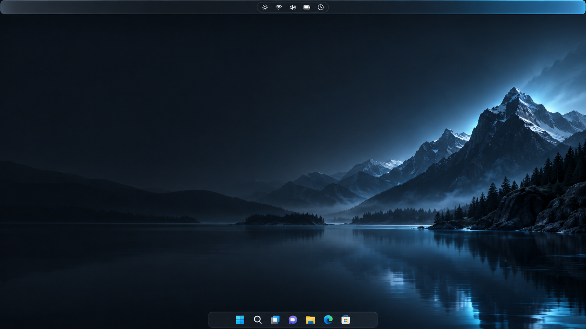

<p align="center">
  
</p>

<h1 align="center">Brimbar</h1>

<p align="center">
  A native Windows status bar that brings the system tray to the top edge—without moving the taskbar.
</p>

<p align="center">
  <a href="https://github.com/Cooperiano/Brimbar/actions/workflows/build.yml"></a>
  
  
  <a href="LICENSE"></a>
  
</p>



> **Brimbar is experimental system software.** The current release is a reversible UI Automation proxy with a read-only Explorer bridge probe. It does not yet hide or replace the original Windows tray.

Brimbar 把 Windows 托盘和系统状态带到屏幕顶部，同时保留底部居中的原生任务栏。项目坚持纯 Win32、可退出、可回滚，并对未知 Windows build 默认拒绝加载底层桥接模块。

## What it looks like

The image below is a real capture from the current Win32 build. The large hero above is a visual direction render, not a claim about finished functionality.


## What works today

- A full-width, DPI-aware Win32 AppBar anchored to the top edge.
- Real application icons from the current Windows tray, laid out on the left; hidden icons are discovered after Explorer creates its overflow surface or after an explicit refresh.
- Input, network, volume, battery, time, and desktop actions on the right.
- Primary and context-menu activation forwarded to the corresponding live Explorer tray item.
- High-quality icon lookup from executables or app packages, with a transparent capture fallback.
- Double-buffered composition to avoid hover and refresh flicker.
- Non-invasive startup and background refresh: Brimbar never opens the overflow flyout merely to initialize itself.
- Native Windows Service host code for session lifecycle management.
- A build-gated, one-shot Explorer bridge that currently performs read-only runtime discovery.

## Project status

| Area | Status | Notes |
|---|---|---|
| Top AppBar | Working | Native Win32, full width, DPI-aware |
| Tray discovery | Working | UI Automation against Explorer tray surfaces |
| Icon rendering | Working | Jumbo icon preference with transparent fallback |
| Left/right click | Working | Resolved against the current live tray object |
| Session service | Implemented | Not installed automatically |
| Explorer bridge | Read-only | Exact-build gated probe and shared-memory handshake |
| Hide the original tray | Not enabled | Requires verified symbols, rollback, and crash fuse |
| Startup installer | Not included | Deliberately avoids changing the system during development |

## Architecture

```text
Session 0
└─ brimbar_service.exe
   └─ watches the active interactive session

User session
├─ brimbar_topbar.exe
│  ├─ Win32 AppBar and renderer
│  └─ UI Automation tray adapter
├─ brimbar_tray_probe.exe
│  └─ read-only Explorer surface diagnostics
└─ brimbar_bridge_controller.exe
   └─ one-shot, build-gated load
      └─ brimbar_explorer_bridge.dll
         └─ read-only SystemTray.dll discovery
```

Windows tray objects live in the logged-in user's `explorer.exe`; a service in Session 0 cannot own that UI directly. Brimbar therefore keeps lifecycle supervision separate from the user-session AppBar and the tightly constrained Explorer bridge.

## Build from source

Requirements:

- Windows 11 x64
- Visual Studio 2022 with **Desktop development with C++**
- CMake 3.24 or newer

```powershell
cmake -S . -B build -G "Visual Studio 17 2022" -A x64
cmake --build build --config Release --parallel
ctest --test-dir build -C Release --output-on-failure
cmake --install build --config Release --prefix dist
```

Run the bar manually:

```powershell
.\dist\brimbar_topbar.exe
```

Inspect the current tray and bridge environment:

```powershell
.\dist\brimbar_tray_probe.exe --all
.\dist\brimbar_bridge_controller.exe
```

`brimbar_service.exe` does not install itself. This prevents a development build from silently adding a service or startup entry.

## Safety model

1. Unknown Windows builds are rejected by default.
2. Missing modules, symbols, or XAML targets leave Explorer unchanged.
3. The current bridge is one-shot and read-only; it does not persist or hide the system tray.
4. A fixed-name handshake collision aborts instead of trusting an ambiguous bridge state.
5. Native takeover remains blocked until symbol validation, crash fusing, and automatic rollback are complete.

## Roadmap

- Resolve the real `SystemTray.IconView` model on explicitly supported builds.
- Add a crash fuse and automatic recovery before any persistent Explorer integration.
- Hide only the duplicated bottom-tray surface while preserving all native flyouts.
- Add an explicit, reversible installer and startup toggle.
- Expand multi-monitor behavior and accessibility coverage.

## Contributing

Issues and focused patches are welcome. Read [CONTRIBUTING.md](CONTRIBUTING.md) before changing Explorer integration. Report security-sensitive findings according to [SECURITY.md](SECURITY.md); do not publish memory dumps, usernames, machine paths, or exploit-ready injection details in an issue.

## License

[MIT](LICENSE) © 2026 Cooperiano.
